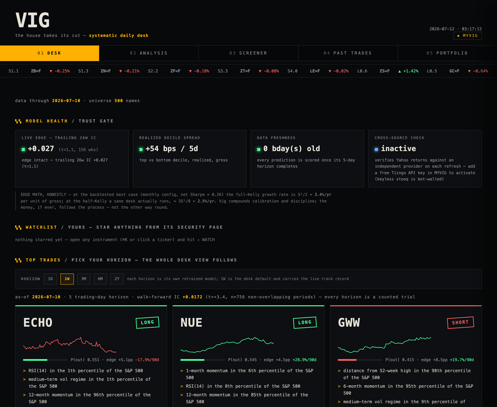
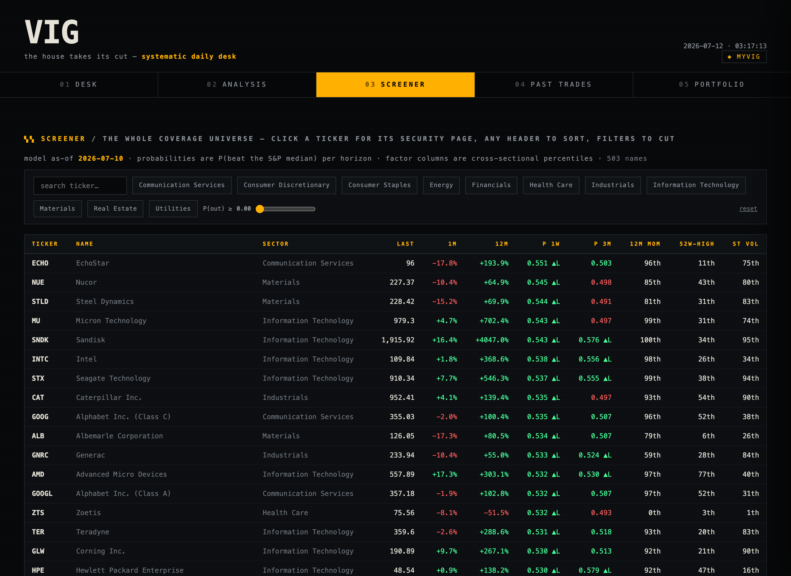
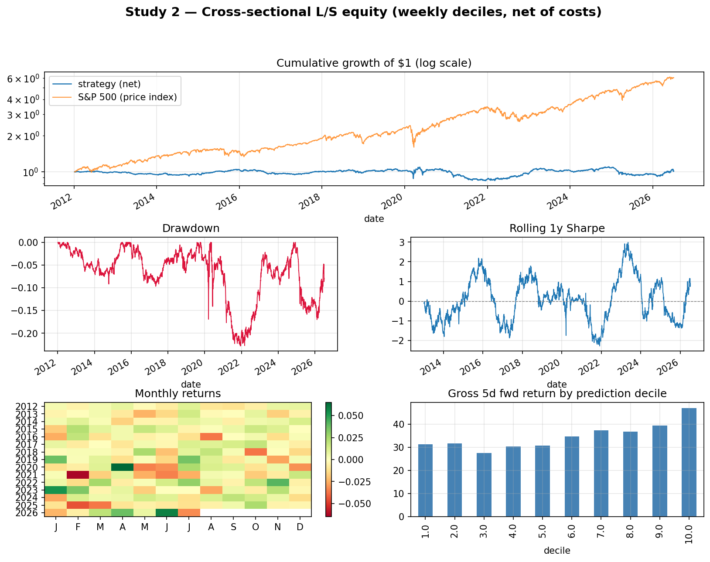
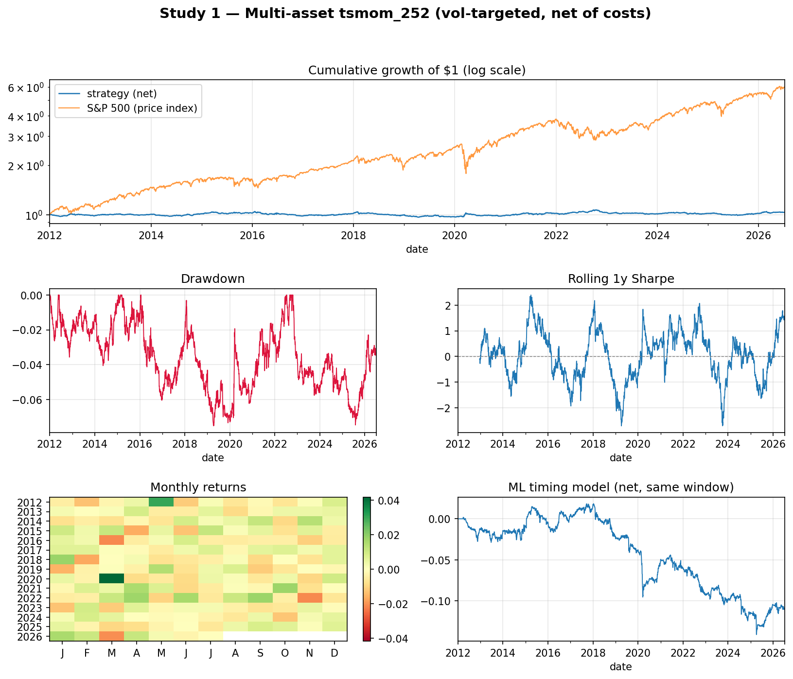

# Quark — systematic trading research, done honestly

Two research studies on a shared, unit-tested backtest engine, built to answer
one question: **after you remove every standard source of backtest inflation,
what is actually left?**

The research ships as **Vig**, a self-grading personal terminal (below) —
five screens of serverless HTML regenerated every morning by a scheduled job,
launched from Spotlight, no cloud required.



**The desk:** a trust gate (live IC of the model's own predictions, scored
after every horizon completes; realized decile spread; data freshness; an
independent cross-source data check), your watchlist, and the day's top
trades at a switchable horizon (1D/1W/3M/6M/2Y — each a separately retrained,
separately walk-forward-validated model whose honest validation stats are
quoted next to its picks).



**Also in the terminal:** a full S&P screener with model probabilities and
factor percentiles; an analysis screen (news wire cross-referenced against
the book's live stances + a two-horizon technical board); a graded record
of every past model call with computed self-diagnosis — the same page hosts
**your** trade journal, graded on P&L *and* same-window alpha vs the S&P,
with a rule-based coach; and a portfolio builder (risk-parity core,
no-leverage vol targeting, VaR, worst-drawdown episodes) with a holdings
tracker that recommends rebalancing in dollars. `⌘K` opens any of ~580
instruments as a full security page. Every number links back to the research
below — signals ship with their evidence.

- **Study 1 — Multi-asset time series.** 78 instruments (G10+EM FX and
  crosses, equity indices, commodity & bond futures, crypto; the 4
  hindsight-picked mega-caps excluded), 2004–present. Classic indicator
  strategies and a walk-forward ML timing model, all vol-targeted and net of
  costs.
- **Study 2 — Cross-sectional long-short US equity (flagship).** ~500 S&P 500
  stocks ranked weekly by a gradient-boosted model; dollar-neutral extreme
  deciles, net of costs, purged walk-forward.

## 2026-07 campaign — the honest search widened

A two-day research push (logged in full in [RESEARCH_NOTES.md](RESEARCH_NOTES.md);
~50 registered trials, ten adversarially-verified literature reviews) chased the
flagship's near-zero net edge to its source and kept only what survived a
walk-forward *config-selection* gate — the harshest test in the repo.

- **Cost-aware construction (Garleanu-Pedersen partial rebalancing)** lifted the
  weekly book, but a point-in-time membership rerun showed most of the gain was
  survivorship: honest S&P net Sharpe plateaued ~0.1–0.28 *in-sample-selected*,
  and **collapsed to ~0.05 under walk-forward config selection** — the flagship's
  economic edge is not distinguishable from zero at honest selection, though the
  IC (t≈2.2–2.4) is real. Stated plainly rather than buried.
- **New free data families** (EDGAR fundamentals + Form-4 insider flow + overnight/
  intraday decomposition) raised composite IC to **t=3.9** on a 5,594-name broad
  panel — the strongest statistic in the repo — but large-cap economics stayed thin.
- **The survivor: a cross-sectional book across 77 instruments and 7 asset classes**
  (the Study-1 universe traded *relative-value* instead of time-series) —
  **walk-forward net Sharpe 0.85**, shuffled-control clean, 12/15 years positive,
  ~+0.08 correlated to the equity book. The edge was never in the most-arbitraged
  pond; it was in cross-asset relative value at a scale institutions under-fish.
- **A forward storm detector** (learns the pre-move state from price texture alone):
  out-of-sample AUC 0.76, 2.6× top-decile lift, positive 11/11 years. The learned
  "calm before the storm" is *exhaustion* — crashed-and-stabilised high-vol names —
  not serenity.
- **Ten cited literature reviews** (`reports/deep_research_*.md`): net-of-cost
  construction, the factor zoo's large-cap decay, the working mathematics
  (fundamental law, fractional Kelly), market history, the engineering body, risk
  & game theory, the masters of niche-edge extraction, and prediction-market
  microstructure. Sizing doctrine adopted from Benter/Thorp: shrink the edge, then
  ~1/5-Kelly.

The through-line is unchanged: **kill everything that deserves to die, size what
survives as if the estimate is wrong.**

## Headline results (all out-of-sample 2012+, all net of costs)

| | cagr | ann_vol | sharpe | sortino | max_dd | calmar | hit_rate | skew |
|---|---|---|---|---|---|---|---|---|
| xsec_ls_weekly (S2) | -0.000 | 0.077 | 0.038 | 0.054 | -0.220 | -0.000 | 0.517 | 0.410 |
| ml_timing (S1) | -0.008 | 0.017 | -0.455 | -0.597 | -0.146 | -0.053 | 0.499 | -0.994 |
| tsmom_252 (S1) | 0.001 | 0.025 | 0.072 | 0.101 | -0.073 | 0.020 | 0.504 | 0.014 |
| buy&hold ^GSPC | 0.130 | 0.167 | 0.818 | 1.154 | -0.339 | 0.384 | 0.545 | -0.362 |

**What survived rigorous treatment:**

1. **The cross-sectional model has real predictive power**: weekly IC = 0.0172,
   t-stat = 3.35 over 756 weeks, near-monotonic decile spread (bottom→top:
   ~31→46 bps gross per 5 days), and a clean shuffled-label control
   (AUC 0.500, IC ≈ 0). The signal is almost entirely **long-side** — shorting
   large caps did not pay — and weekly turnover consumes most of it
   (net Sharpe 0.04 weekly; 0.26 at monthly rebalance). No-trade bands
   (enter the decile, exit only after rank decays) lift weekly net Sharpe to
   0.13–0.18, monotone across the three registered exit gaps, at roughly half
   the cost drag — see the turnover study in
   [RESEARCH_NOTES.md](RESEARCH_NOTES.md).
2. **Classic indicators are dead after costs** on the multi-asset universe.
   Best of 8 registered variants (ma_cross_50_200) has a Deflated Sharpe Ratio
   of 0.19 — indistinguishable from the luck of picking the best of 8 coin
   flips.
3. **The daily ML timing model failed honestly**: mean fold AUC 0.518 does not
   clear transaction costs (net Sharpe −0.44 on its own OOS window; −0.455 in
   the common-window table above). Reported, not massaged.




The whole argument on one page:
[reports/quark_onepager.pdf](reports/quark_onepager.pdf)
(`python scripts/make_onepager.py`).

## Why these numbers can be trusted

Most hobby backtests are broken in the same five ways. Each one is closed off
here **by construction and by unit test**:

| Failure mode | Defense |
|---|---|
| Lookahead | Engine applies `positions = signal.shift(lag)`, `lag>=1` enforced; a test feeds a signal that "knows" a price jump the day it happens and asserts zero PnL ([tests/test_engine.py](tests/test_engine.py)) |
| Free trading | Per-asset-class costs on turnover (see table below), entry bars included; gross ≥ net asserted |
| Multiple testing | Every variant lives in a counted registry; best-of-family Sharpe is deflated (Bailey & López de Prado DSR) against the expected max of N null trials |
| Train/test leakage | Purged + embargoed walk-forward (purge ≥ target horizon, unit-tested gap); features pass a truncation-invariance test; shuffled-label control run for every ML study |
| Metric inflation | CAGR is geometric; drawdown is on the equity curve; Sharpe convention rf=0 documented |

**Transaction cost assumptions (bps on turnover):** G10 FX 2 · EM FX 8 ·
FX crosses 3 · equity index futures 1.5 · commodities 3 · bond futures 1 ·
crypto 10 · single stocks 5.

**Position sizing:** signals in [−1,1] scaled to a 10% annualized
per-instrument vol target (63d estimator, leverage capped at 4×); portfolio =
equal-weight across live instruments (inverse-vol). No portfolio optimizer —
optimizing weights on in-sample Sharpes is the exact trap this repo avoids.

## Data

Yahoo Finance daily adjusted OHLCV in SQLite (`Quark.db`, gitignored;
rebuild with `python scripts/refresh_data.py`). Data quality is a first-class
deliverable: duplicate, gap, stale-run and spike detection runs before every
study (it catches, e.g., the negative WTI close of 2020-04-20 and a
holiday-NaN artifact that silently voided 10% of forward-return windows — see
[RESEARCH_NOTES.md](RESEARCH_NOTES.md)).

Known limitations, stated rather than hidden:

- **Survivorship bias (Study 2): measured, not just disclaimed.** The shipped
  universe is *today's* S&P 500 members. A best-effort point-in-time rerun
  (Wikipedia change history + 45% Yahoo recovery of delisted names,
  `scripts/run_pit_study.py`) shows the signal survives — IC +0.0127
  (t = 2.38) vs +0.0164 — but the decile spread drops ~40% and weekly net
  Sharpe goes negative. Read the shipped numbers as upper bounds by roughly
  that margin; details in [RESEARCH_NOTES.md](RESEARCH_NOTES.md).
- Yahoo continuous futures (`=F`) are not back-adjusted → trend signals embed
  roll noise. Production would use ratio-back-adjusted series.
- `^GSPC` is a price index: the buy-and-hold benchmark understates total
  return by ~2%/yr of dividends, and its Sharpe is overstated by rf.
- `^TNX` is a yield index, not a price — it is `tradable=False` and used only
  as an ML feature (rate level/change).
- FX pairs are traded as quoted (`long JPY=X` = long USD vs JPY); quote
  conventions are recorded in [quark/universe.py](quark/universe.py).
- The 4 mega-cap stocks in the multi-asset DB (MSFT/NVDA/META/GOOGL) were
  hindsight picks — excluded from all Study 1 headline results.

## Repo layout

```
quark/
  universe.py        asset classes, costs, tradability — single source of truth
  data/              loader, quality checks, Yahoo refresh
  backtest/          engine (signal + weights modes), sizing, costs, metrics (incl. DSR)
  strategies/        classic signal functions + counted registry
  ml/                features, targets, purged splits, timing pipeline, xsec study
  reports/           tearsheet + tables
scripts/             refresh_data | run_baselines | run_ml | run_xsec | make_report
tests/               68 tests, synthetic fixtures only — no DB needed
legacy/              the original 2025 project, kept for the before/after story
```

## Reproduce everything

```bash
pip install -e .
python -m pytest                     # 68 tests, <2s, no data required
python scripts/refresh_data.py       # ~550 tickers from Yahoo -> Quark.db
python scripts/run_baselines.py      # classic registry + DSR verdict
python scripts/run_ml.py             # Study 1: folds, shuffled control, corr-to-momentum
python scripts/run_xsec.py           # Study 2: IC, deciles, shuffled control
python scripts/make_report.py        # tearsheets + results table
python scripts/run_turnover_study.py # no-trade-band study (pre-registered)
python scripts/build_pit_universe.py # point-in-time membership + recovery
python scripts/run_pit_study.py      # survivorship bias, measured
python scripts/make_onepager.py      # one-page PDF summary
```

Every number in this README is regenerated by the commands above (the
headline table and IC by `run_baselines`/`run_ml`/`run_xsec`/`make_report`;
the studies and PDF by the last four).
